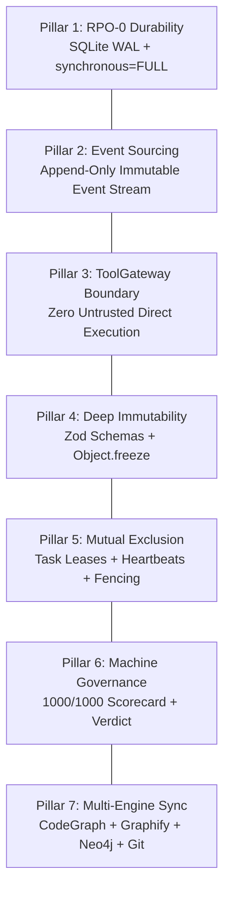
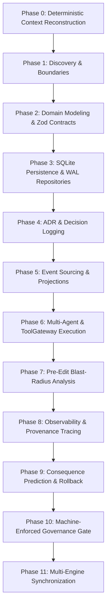

# ANANTHAM V2 — Knowledge Transfer (KT) & Autonomous Orchestration Guide for ChatGPT

> **Target Audience**: ChatGPT, GPT-4o, Claude, or any external AI coding assistant working on the **Anantham V2** codebase.
> **Mission**: Provide complete, unambiguous context on Anantham V2's architecture, operational rules, persistence invariants, security boundaries, and execution workflows.

---

# 1. Executive Summary & Core Philosophy

**Anantham V2** is a **Programmable AI Agent Operating Environment** built on Node.js (v25+) and TypeScript (strict mode). 

It is designed as an industrial-grade, deterministic runtime where:
- **Authoritative State** is durably committed to SQLite using WAL mode (`synchronous = FULL`) ensuring **RPO 0 durability**.
- **State Evolution** follows **Append-Only Event Sourcing**: events are immutable facts, and all aggregate states, task boards, and session projections are 100% deterministically reconstructible from the event stream.
- **Tool Execution** is strictly mediated by the **ToolGateway**: agents never execute system tools directly; all operations are validated, risk-classified, and audit-logged.
- **Session Continuity** is preserved through **Stateless Disaster Recovery**: any crashed process, fresh boot, or remote agent can instantly re-hydrate full context from Git and SQLite.

---

# 2. The 7 Non-Negotiable Pillars



1. **Pillar 1: RPO 0 Durability**:
   Every state mutation (session creation, task update, event append, checkpoint save) must be transactionally committed to disk in SQLite with WAL mode and `synchronous = FULL`. In-memory state is never treated as authoritative.

2. **Pillar 2: Event Immutability & Reconstructibility**:
   Events in the `events` table are append-only historical facts. Never update or delete historical events. Projections (`SessionSummaryProjection`, `TaskBoardProjection`) and reducers are strictly derived views. If a projection disagrees with the event stream, the event stream always wins.

3. **Pillar 3: ToolGateway Security Boundary**:
   Agents do not have direct access to child processes, raw disk, or network sockets. All tool calls must route through `ToolGateway` for schema validation, risk classification, approval gating, and audit logging.

4. **Pillar 4: Type-Safe Domain Contracts & Immutability**:
   All 12 core domain entities (`Project`, `Session`, `Task`, `HarnessEvent`, `Checkpoint`, `Artifact`, `Attachment`, `MemoryItem`, `ContentObject`, `ContextPlan`, `Provenance`, `SecurityMetadata`) have runtime Zod schemas and deep immutability helpers (`freezeTask`, `freezeCheckpoint`, etc.).

5. **Pillar 5: Task Lease Management & Mutual Exclusion**:
   Tasks must be leased exclusively (`LeaseManager`) with TTLs and heartbeats before execution. Expired leases are evicted during recovery, and running tasks are safely rolled back to `queued` to prevent duplicate agent execution.

6. **Pillar 6: 1000-Point Quality Scorecard & Mandatory Verdict**:
   Every milestone must achieve 1000/1000 on the automated scorecard (`scripts/certification-scorecard.ps1`) and output a standardized **ANANTHAM ENGINEERING VERDICT**.

7. **Pillar 7: Multi-Engine Knowledge Graph & Stateless Recovery**:
   At the end of every task, the codebase is synchronized across **CodeGraph** (AST call paths), **Graphify** (codebase ontology & community clusters), **Neo4j** (Cypher graph), **Graphiti** (episodic memory), and committed/pushed to **GitHub** via `npm run sync:all`.

---

# 3. Source Authority Hierarchy

When resolving requirements, architecture, or contradictions, strictly obey this precedence:

```text
1. System/Security Invariants (RPO-0 durability, ToolGateway isolation, zero-untrusted-execution)
2. Anantham V2 PRD Requirements (Part 1, Part 2, Part 3 in 'ANANTHAM PROJECT SOURCES/prd/')
3. Accepted ADRs (docs/discovery/decision-log.md)
4. Versioned Contracts & Types (src/domain, src/persistence, src/event-state)
5. Unit and Integration Tests (tests/)
6. Existing Implementation
7. Project-Specific Instructions
8. Current Task Request
9. Model Assumptions
```

> **A lower-level source cannot silently override a higher-level source.**

---

# 4. The 11-Phase Autonomous Lifecycle

Every developer or AI assistant must follow these 11 phases during execution:



- **Phase 0 (Startup)**: Read `docs/discovery/current-state.md`, check `git status --porcelain`, read `active-tasks.md`, and verify baseline health (`npm run typecheck`, `npm test`).
- **Phase 1 (Discovery)**: Inspect directory boundaries and PRD requirements before proposing changes.
- **Phase 2 (Domain)**: Define Zod schemas and freeze functions in `src/domain/`.
- **Phase 3 (Persistence)**: Implement transactional repositories using native `node:sqlite` in `src/persistence/`.
- **Phase 4 (ADR)**: Record non-trivial design decisions in `docs/discovery/decision-log.md`.
- **Phase 5 (Event Sourcing)**: Append immutable events to `EventStore` and update `ProjectionManager`.
- **Phase 6 (Execution)**: Enforce ToolGateway risk classification and execution sandboxes.
- **Phase 7 (Blast Radius)**: Check symbol callers across `src/` and `tests/` before editing shared entities.
- **Phase 8 (Observability)**: Ensure `correlationId` and `parentEventId` are propagated across all events.
- **Phase 9 (Consequence Prediction)**: Verify migrations are reversible and checkpoints are valid.
- **Phase 10 (Governance Gate)**: Run `npm run verify` (`typecheck`, `test`, `build`, `scorecard 1000/1000`).
- **Phase 11 (Multi-Engine Sync)**: Run `npm run sync:all` to sync CodeGraph, Graphify, Neo4j, Graphiti, and Git commit.

---

# 5. Codebase Subsystems & Directory Map

| Path | Subsystem | Description |
| :--- | :--- | :--- |
| `src/domain/` | Core Contracts | 12 domain models, Zod validation schemas, state machines, deep immutability helpers. |
| `src/persistence/` | SQLite Engine & Repos | Native `node:sqlite` (DatabaseSync), WAL mode, migrations engine, 8 domain repositories (`ProjectRepository`, `SessionRepository`, `TaskRepository`, `EventRepository`, `CheckpointRepository`, `ArtifactRepository`, `AttachmentRepository`, `MemoryRepository`). |
| `src/event-state/` | Event & State Engine | `EventStore` (append-only, safe pub/sub), state reducers (`session-reconstruct.ts`, `task-reconstruct.ts`), `ProjectionManager`, and `SessionTreeManager` (zero-mutation branching). |
| `src/recovery/` | Checkpoints & Crash Recovery | `CheckpointManifestBuilder` (canonical SHA-256), `CheckpointValidator`, `LeaseManager`, `OrphanDetector`, `CrashRecoveryEngine`. |
| `tests/` | Vitest Test Suites | 29 test suites (77 passing tests) covering durability, persistence, event streams, recovery, and disk crash simulations. |
| `scripts/` | Tooling & Governance | `verify-all.ps1`, `certification-scorecard.ps1`, `sync-codegraph.ps1`, `sync-graphify.ps1`, `sync-neo4j.ps1`, `sync-graphiti.mjs`, `sync-git.ps1`, `post-task-sync.ps1`, `generate-verdict.mjs`. |
| `docs/discovery/` | Project State Ledgers | `current-state.md` (active snapshot), `active-tasks.md`, `decision-log.md`, `V1.0-Anantham-Orchestrator.md`. |
| `docs/governance/` | Certification & Audits | `scorecard.json` (1000/1000), `conditions.json`, `graphiti-episodes.jsonl`. |

---

# 6. Essential Developer & Agent Commands

Run these standard npm scripts during development:

```powershell
# 1. Typecheck strict mode (0 errors required)
npm run typecheck

# 2. Run automated test suites (100% pass rate required)
npm test

# 3. Full Verification Pipeline (Typecheck + Test + Build + 1000/1000 Scorecard)
npm run verify

# 4. Evaluate 1000-Point Quality Scorecard
npm run scorecard

# 5. Full End-of-Task Multi-Engine Sync (Runs verify + CodeGraph + Graphify + Neo4j + Graphiti + Git Commit + Verdict)
npm run sync:all

# 6. Individual Knowledge Graph syncs
npm run sync:codegraph   # Syncs AST call paths to .codegraph/
npm run sync:graphify    # Syncs ontology & communities to graphify-out/
npm run sync:neo4j       # Exports idempotent Cypher statements to scripts/neo4j-sync.cypher
npm run sync:graphiti    # Appends episodic memory to docs/governance/graphiti-episodes.jsonl
npm run sync:git         # Stages and commits state for remote disaster recovery
```

---

# 7. Mandatory Engineering Verdict Format

Every completed task **MUST** conclude with this structured verdict block:

```text
======================================================
           ANANTHAM ENGINEERING VERDICT
======================================================
Phase: <Phase ID, e.g. P1>
Subphase: <Subphase ID, e.g. P1.4>
Task: <Task Name & ID>
Commit: <Active Git Commit SHA>

VERDICT: <PASS | PASS_WITH_RISKS | BLOCKED | FAIL | ARCHITECTURE_DECISION_REQUIRED>

WHAT IT WAS SUPPOSED TO DO:
<Description of requirement>

WHAT IT ACTUALLY DID:
<Concrete changes performed>

WHAT IT DOES NOW:
<Runtime behavior and capabilities>

FILES CHANGED:
<List of modified and created files>

CONTRACTS:
<Entities, interfaces, and schemas added or updated>

STATE/PERSISTENCE:
<SQLite tables, migrations, or event types affected>

SECURITY:
<Policies, trust boundaries, or validations enforced>

RECOVERY:
<Crash, restart, or resume semantics preserved>

TESTS ACTUALLY RUN:
<Test files and number of passing assertions>

VERIFICATION EVIDENCE:
<Build status, typecheck status, scorecard score>

UNKNOWN:
<Any unverified environment behaviors or None>

RISKS:
<Known risks or None>

UNRESOLVED:
<Open questions or None>

CHECKLIST UPDATED: YES

NEXT:
<Next task in the Master Development Plan>
======================================================
```

---

# 8. Prohibited Actions (Strict Anti-Patterns)

When working in Anantham V2, **NEVER**:
1. ❌ **Never mutate historical events**: Events in `events` are immutable facts. Never issue `UPDATE` or `DELETE` on the `events` table.
2. ❌ **Never treat projections as authoritative**: Projections are strictly rebuildable read caches. If a projection conflicts with the event log, the event log always wins.
3. ❌ **Never execute raw tools without ToolGateway**: Do not invoke child processes, shell commands, or network calls from agents directly.
4. ❌ **Never mark tasks complete without automated tests**: A task is only complete (`[x]`) when backed by passing unit and integration tests.
5. ❌ **Never commit with failing typechecks or broken builds**: `npm run typecheck` must report 0 errors under `strict: true`.
6. ❌ **Never silently delete orphans or corruption**: Orphan artifacts and corrupted checkpoints must be classified, preserved, and logged in `RecoveryRecord`.
