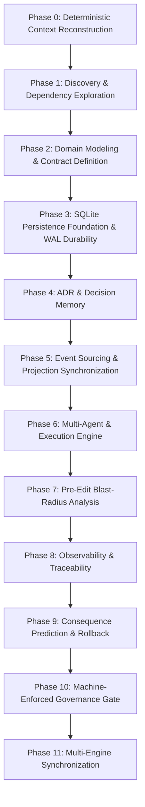

# V1.0 Unified Autonomous Software Intelligence Orchestrator — Anantham V2

## Purpose & Scope

This document defines the authoritative, machine-verifiable operational workflow for the **Anantham V2 Platform**.

It operationalizes the principles of the **Anantham V2 PRDs** and the **Anantham Engineering Playbook** into an immutable 11-Phase autonomous development lifecycle.

---

# 1. Core Operating Tenets (The 7 Pillars)

1. **Artifacts Over Assertions**: No status claim is recognized without machine-verifiable evidence artifacts (`scorecard.json`, `conditions.json`, test reports, compilation status).
2. **Deterministic Session Boot**: Every session begins with cryptographic validation of Git commit, state ledger, and SQLite engine integrity.
3. **Pre-Edit Blast-Radius Verification**: Zero modifications to shared domain entities, events, or repository interfaces without checking callers and covering test suites.
4. **RPO-0 Durability Invariant**: Authoritative state mutations must be transactionally committed to SQLite in WAL mode (`synchronous = FULL`) before acknowledging success.
5. **Event Immutability & Reconstructibility**: Authoritative events are append-only immutable facts. All projection views and session trees must be 100% reconstructible from the event stream.
6. **ToolGateway Security Boundary**: Agents never execute tools directly. All operations must route through the ToolGateway for schema validation, risk classification, and policy authorization.
7. **Autonomous Governance & Quality Gates**: Every completed milestone must score 1000/1000 on the automated quality scorecard and record an explicit `ANANTHAM ENGINEERING VERDICT`.

---

# 2. The 11-Phase Autonomous Lifecycle

### Phase 0 — Deterministic Context Reconstruction
* **Trigger**: Startup of any agent or developer session.
* **Actions**:
  1. Load [`docs/discovery/current-state.md`](file:///C:/herness/docs/discovery/current-state.md).
  2. Verify active commit with `git status --porcelain`.
  3. Load [`docs/discovery/active-tasks.md`](file:///C:/herness/docs/discovery/active-tasks.md) and [`ANANTHAM_V2_MASTER_DEVELOPMENT_PLAN.md`](file:///C:/herness/ANANTHAM%20PROJECT%20SOURCES/DEVELOPMENT/ANANTHAM_V2_MASTER_DEVELOPMENT_PLAN.md).
  4. Validate baseline health (`npm run typecheck` and `npm test`).
* **Output**: Validated Context Verification Report.

### Phase 1 — Discovery & Dependency Exploration
* **Trigger**: Milestone initiation or feature expansion.
* **Actions**:
  1. Inspect directory and package boundaries (`src/domain`, `src/persistence`, `src/event-state`).
  2. Review PRD requirements in [`ANANTHAM PROJECT SOURCES/prd/`](file:///C:/herness/ANANTHAM%20PROJECT%20SOURCES/prd/).
  3. Ensure zero unnecessary external runtime dependencies.
* **Output**: Dependency & Boundary Map.

### Phase 2 — Domain Modeling & Contract Definition
* **Trigger**: Interface or schema modifications.
* **Actions**:
  1. Define Zod validation schemas in `src/domain/`.
  2. Ensure immutability helper integration and state machine transitions.
  3. Export unified types in `src/domain/index.ts`.
* **Output**: Type-Safe Domain Contracts.

### Phase 3 — SQLite Persistence Foundation & WAL Durability
* **Trigger**: Storage schema or repository modifications.
* **Actions**:
  1. Implement transactional SQL operations with native `node:sqlite`.
  2. Maintain migration engine with SHA-256 checksum tracking in `_migrations`.
  3. Enforce WAL mode, `synchronous = FULL`, and `foreign_keys = ON`.
* **Output**: Durable SQLite Repositories.

### Phase 4 — ADR & Decision Memory
* **Trigger**: Any architectural or design choice.
* **Actions**:
  1. Record human decisions in [`docs/discovery/decision-log.md`](file:///C:/herness/docs/discovery/decision-log.md).
  2. Document trade-offs, security impacts, persistence impacts, and recovery semantics.
* **Output**: Immutable Decision Records.

### Phase 5 — Event Sourcing & Projection Synchronization
* **Trigger**: State mutation or read model changes.
* **Actions**:
  1. Append immutable events to the `EventStore`.
  2. Update in-memory and durable projections via `ProjectionManager`.
  3. Support lossless projection rebuilds from genesis events.
* **Output**: Synchronized Event Streams & Projections.

### Phase 6 — Multi-Agent & Execution Engine
* **Trigger**: Tool, agent, or workflow execution.
* **Actions**:
  1. Enforce strict ToolGateway authorization and policy checks.
  2. Isolate worktrees and execution sandboxes.
  3. Guard against prompt injection and command injection.
* **Output**: Authorized & Observable Executions.

### Phase 7 — Pre-Edit Blast-Radius Analysis
* **Trigger**: Before modifying shared utilities or domain entities.
* **Actions**:
  1. Trace symbol references across `src/` and `tests/`.
  2. Identify and execute covering unit and integration tests.
* **Output**: Blast-Radius Impact Report.

### Phase 8 — Observability & Traceability
* **Trigger**: Runtime operations and events.
* **Actions**:
  1. Assign `correlationId` and `parentEventId` to all events and logs.
  2. Retain full provenance for attachments, artifacts, and memory items.
* **Output**: Full Distributed Provenance Graph.

### Phase 9 — Consequence Prediction & Rollback
* **Trigger**: Release candidate or major migration.
* **Actions**:
  1. Validate migration reversibility and integrity checks (`PRAGMA integrity_check`).
  2. Verify checkpoint restoration and crash recovery.
* **Output**: Recovery & Rollback Plan.

### Phase 10 — Machine-Enforced Governance Gate
* **Trigger**: Task completion.
* **Actions**:
  1. Run `npm run typecheck` (0 TypeScript errors under `strict: true`).
  2. Run `npm test` (100% test pass rate).
  3. Run `npm run scorecard` (`scripts/certification-scorecard.ps1`) to verify 1000/1000 score.
  4. Update [`docs/governance/scorecard.json`](file:///C:/herness/docs/governance/scorecard.json).
* **Output**: 1000/1000 Certified Quality Scorecard.

### Phase 11 — Multi-Engine Synchronization
* **Trigger**: Milestone finalization.
* **Actions**:
  1. Synchronize CodeGraph AST and call path graph (`npm run sync:codegraph`).
  2. Synchronize Graphify knowledge graph, reports, and static Ontology Studio (`npm run sync:graphify`).
  3. Synchronize Neo4j graph database with idempotent Cypher exports (`npm run sync:neo4j`).
  4. Synchronize Graphiti episodic memory and architecture decisions (`npm run sync:graphiti`).
  5. Update [`docs/discovery/current-state.md`](file:///C:/herness/docs/discovery/current-state.md).
  6. Update [`docs/discovery/active-tasks.md`](file:///C:/herness/docs/discovery/active-tasks.md).
  7. Update [`ANANTHAM PROJECT SOURCES/DEVELOPMENT/ANANTHAM_V2_MASTER_DEVELOPMENT_PLAN.md`](file:///C:/herness/ANANTHAM%20PROJECT%20SOURCES/DEVELOPMENT/ANANTHAM_V2_MASTER_DEVELOPMENT_PLAN.md).
  8. Run Git state stage, commit, and push to GitHub for stateless recovery (`npm run sync:git`).
  9. Output standardized `ANANTHAM ENGINEERING VERDICT`.
* **Output**: Fully Synchronized Multi-Graph Engines, Sealed Milestone & Pushed Remote State.
